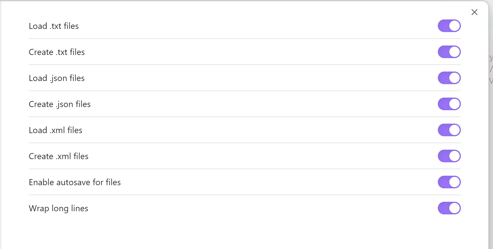

# Data Files Editor

 

Create and edit data and code files inside [Obsidian](https://obsidian.md): `.txt`, `.json`, `.xml`, `.yaml`/`.yml`, `.html`, `.css`, `.js`, `.mjs`, `.ts`, and `.astro`.

> This is a maintained fork of [ZukTol's Data Files Editor](https://github.com/ZukTol/obsidian-data-files-editor), extended with additional file types (notably `.astro`) for the [Vault CMS](https://vaultcms.org) / Astro authoring workflow.

## Installation

This fork is distributed via [BRAT](https://github.com/TfTHacker/obsidian42-brat) rather than the community plugin directory:

1. Install the **BRAT** plugin from the community plugins browser and enable it.
2. In BRAT, choose **Add beta plugin** and enter `davidvkimball/obsidian-data-files-editor`.
3. Enable **Data Files Editor** under Settings → Community plugins.

The original plugin is available in the community directory, but it does not include the extended file types this fork adds.

## Usage

### Settings

Each file type has separate **Load** (open and edit existing files) and **Create** (make new files from the file menu) toggles, so you can enable only the formats you need. Two global options control **autosave** and **line wrapping**. In Obsidian 1.13+ these settings are searchable from the global settings search.

> Changing which file types are handled may require restarting Obsidian to take effect.

### Editing

`.json` and `.yaml`/`.yml` open with syntax highlighting; all other types open in a plain-text code editor (XML highlighting is not yet implemented).

### Creating files

Create a file of any enabled type from the right-click menu in the file explorer. Right-clicking a folder creates the file inside it; right-clicking a file creates the new file alongside it.

## Credits

Originally created by [ZukTol](https://github.com/ZukTol). This fork is maintained by [David V. Kimball](https://github.com/davidvkimball).

## License

[MIT](LICENSE)
